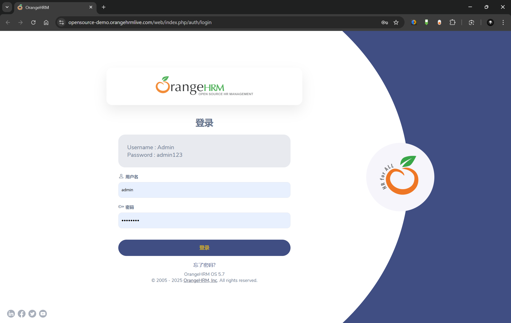

# Bug Report: Incorrect Localization on Login Page

**Environment:**

- **Browser:** Chrome v[Your Version]
- **OS:** Windows 11
- **URL:** https://opensource-demo.orangehrmlive.com/web/index.php/auth/login
- **Language Setting:** Browser/OS set to English (US).

**Description:**
Upon accessing the OrangeHRM login page, several UI elements are displayed in Chinese characters instead of the expected English. This suggests a default or misconfigured localization setting, severely impacting usability for English-speaking users.

**Steps to Reproduce:**

1.  Open a new browser window.
2.  Navigate to the URL: `https://opensource-demo.orangehrmlive.com/web/index.php/auth/login`.
3.  Observe the text on the login page.

**Expected Result:**
The login page should be displayed entirely in English, including labels, placeholders, and button text.

**Actual Result:**
Multiple key elements on the page are displayed in Chinese characters. This includes:

- The "Username" label (显示: 「用户名」)
- The "Password" label (显示: 「密码」)
- The "Login" button (显示: 「登录」)
- The "Forgot your password?" link (显示: 「忘记密码？」)

The page title in the browser tab remains correct: "OrangeHRM".

**Evidence:**

**Severity:** High (UI/Usability)
**Priority:** High

**Notes:**

- The issue is 100% reproducible on a fresh browser session.
- The problem appears to be a server-side or application-level misconfiguration of the default language setting.
- This bug blocks users who cannot read Chinese from effectively using the application.
