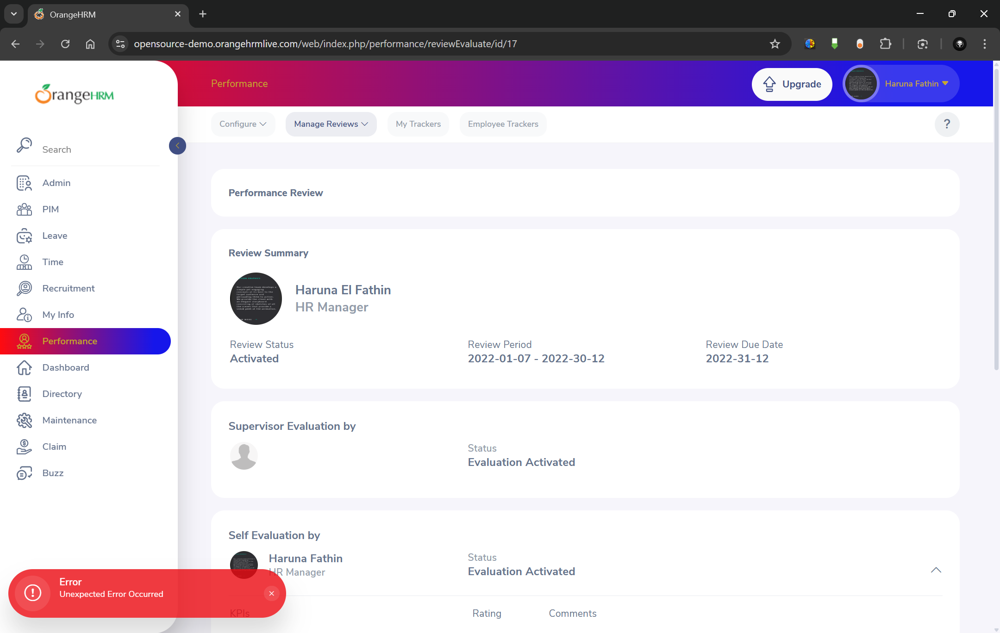

# Bug Report: Unexpected Error Toast on Performance Evaluate

**Environment:**

- **Browser:** Chrome v[Your Version]
- **OS:** Windows 11
- **URL:** https://opensource-demo.orangehrmlive.com/web/index.php/performance/myPerformanceReview

**Description:**
After navigating to the Performance Review page and initiating an evaluation, the system displays a transient "Error Unexpected Error Occured" [sic] message in a toast notification. The page itself loads, but the error message indicates a potential problem with the backend API call.

**Steps to Reproduce:**

1. Log in to the OrangeHRM demo site.
2. Navigate to **Performance** > **My Performance Review** via the sidebar menu.
3. On the "My Performance Review" page, click the **"Evaluate"** button for any review listed.
4. Observe the bottom-left corner of the screen immediately after the new page loads.

**Expected Result:**
The user should be redirected to the evaluation form without any system error messages.

**Actual Result:**
The system redirects to the form but also displays a red toast notification with the text: **"Error Unexpected Error Occured"** for a few seconds. Note the spelling error ("Occured" instead of "Occurred").

**Evidence:**

**Severity:** Medium  
**Priority:** Medium

**Notes:**

- The evaluation form appears functional after the error disappears.
- The error message contains a spelling error ("Occured").
- This bug is easily reproducible.
